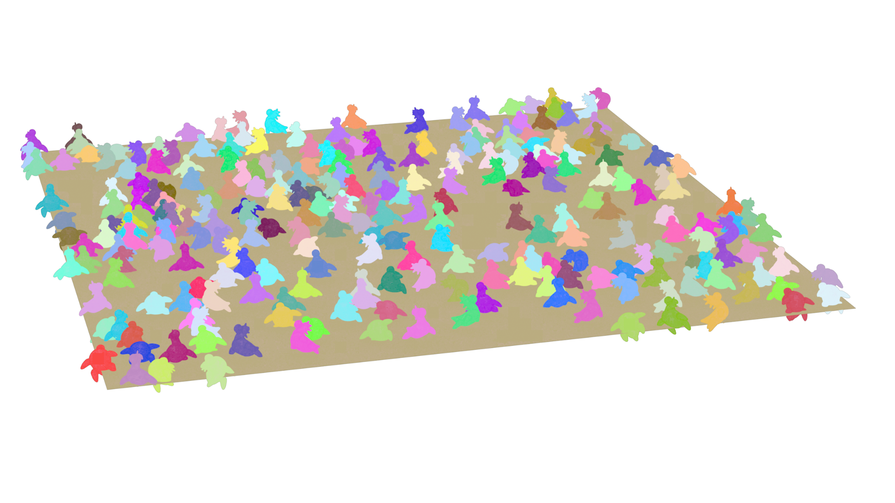
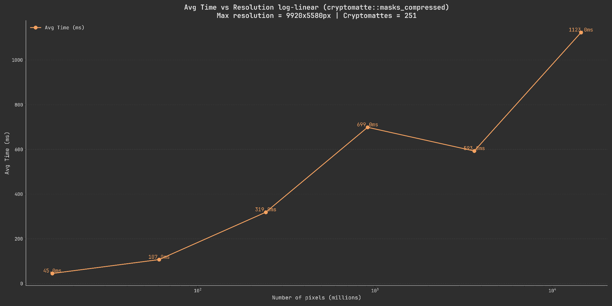
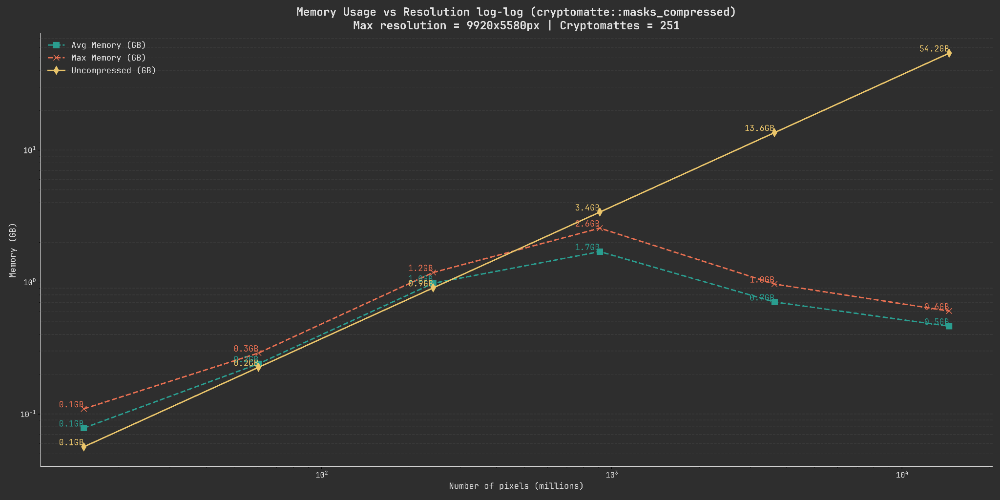
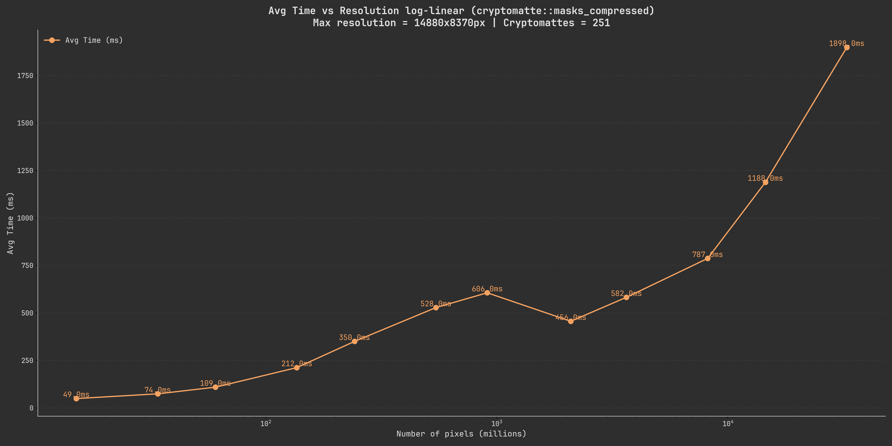
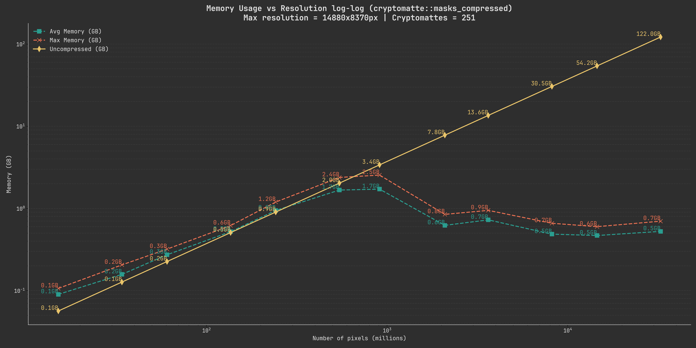
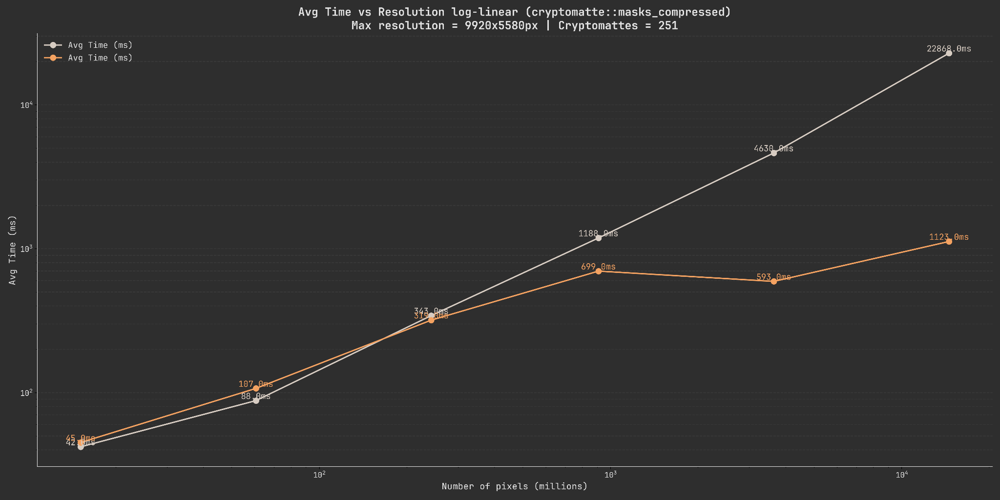
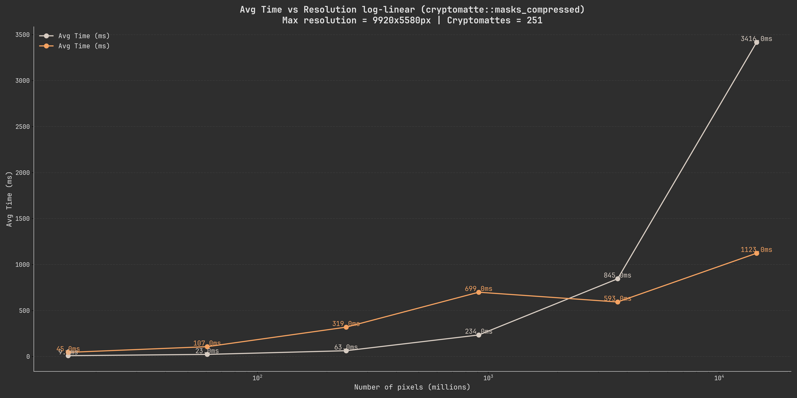

..
  Copyright Contributors to the cryptomatte-api project.

.. _cmatte_benchmarks:

benchmarks
###########

The cryptomatte-api is designed with speed and memory efficiency as one of it's main concerns.
As such, it is continuously checked for both of those metrics and benchmarked

.. note:: 

	The benchmarks below cover only mask extraction as that is the main purpose of the library,
	for read performance it is best to check out the documentation of the `compressed-image <https://github.com/EmilDohne/compressed-image>`_
	library as we merely wrap it for loading images.

Computer hardware
*****************

The following benchmarks were all created using the following computer specs 
(since it is not gpu accelerated only cpu stats are listed):

.. code-block:: none

	cpu: AMD Ryzen 5950x
	ram: 96GB DDR4 3200MHz
	storage: Samsung 980 1TB NVMe M.2 SSD

	compiler: MSVC v143

Test data
**********

The test data was generated using houdini and represents a cryptomatte with 251 total masks
(250 unique rubber toys) across a variety of resolutions:

**Resolutions:**

- 320x180
- 640x360
- 1280x720
- 2480x1440
- 4960x2790
- 9920x5580

It was written out using 6 cryptomatte levels (12 cryptomatte channels).

Benchmarking methodology
*************************

The cryptomatte-api is benchmarked using the google-bench library and each test case is repeated
3 times for every step with the memory being clobbered in-between each run. These tests are then 
repeated 3 times to make sure the results were not outliers. The first result is then chosen for 
display.

Decoding masks compressed
**************************

Results
========

Below you can see two graphs showing both the time needed to decode all of the masks into
compressed buffers as well as the relationship of pixel count to memory usage.

.. note::
	
	Both of these graphs are logarithmic on the x-scale as the resolutions scale exponentially
	(a 2x increase between every step). The memory usage is additionally also logarithmic
	on the y-scale to better show the individual steps.

		  ranging from 45ms to 1123ms following a slightly exponential growth curve.

		  comparing the uncompressed data size to compressed. The memory usage for the masks
		  peaks out at around 2.6GB towards the middle of the graph following a gaussian 
		  curve.

Explanation
============

When looking at the memory usage graph we see a couple of interesting things. Firstly, even as the 
pixel count grows exponentially, the memory usage appears to have a cutoff point where it starts 
decreasing again. Secondly, the speed of the decoding also seems to drop drastically at ~10^3
pixels (which in our case represents 2480x1440 pixels).

Both of these seem to happen at the same point (~13MB) and are also consistenly observable across
runs on different machines. 

A likely explanation for this is related to the chunk size used internally for compression and 
decompression. 

The cryptomatte-api uses the `compressed-image <https://github.com/EmilDohne/compressed-image>`_
library as its underlying storage which uses blocking and chunking techniques to compress buffers
using the ``lz4`` algorithm. The chunk size chosen by the ``cryptomatte-api``, which seems to 
perform well across a variety of test cases, is equivalent to 4MB. 

Since the point at which the memory usage drops again is just past this chunk size, a likely
explanation is that we are able to much more efficiently compress the data at that point.
Giving us much better performance.

We also use ``compressed::lazy_schunk<T>`` internally which, if a chunk in a mask has just a single
value is set to ony store that one value rather than having to store the compressed result with overhead.

Higher sample count
====================

Let's rerun the same benchmarks with more samples in-between as well as extending the upper range
to see if we can get more information:

		  ranging from 45ms to 1898ms following a slightly exponential growth curve.

		  comparing the uncompressed data size to compressed. The memory usage for the masks
		  peaks out at around 2.6GB towards the middle of the graph following a gaussian 
		  curve.

We can see that the same rough relationship is still there, we can also see that 
the memory usage only climbs marginally as we go to a higher resolution. 

Comparison with ImageStacker
=============================

The previous graphs are largely meaningless without a reference point. As a point of comparison I have chosen
to use the `ImageStacker <https://emildohne.com/imagestacker>`_ which is a standalone application
for loading images into photoshop quickly and efficiently. The creation of this library was in large
parts motivated by improving the cryptomatte decoding capabilities of it.

.. note::

	These benchmarks are recorded before the ImageStacker had its implementation changed to use
	the ``cryptomatte-api``. These results are therefore meant to show historical performance numbers.

The ImageStacker internally also compresses its buffers. However, the old implementation did not 
do this in chunks but instead extracted all the masks ahead of time and compressed them after.

Therefore, we have two sections here, one comparing the results of the ``cmatte::cryptomatte::masks_compressed``
function with the time it took the ImageStacker to decode and compress the data. As well 
as comparing it with only the decoding part.

Comparing compressed with compressed
-------------------------------------

This graph compares the cryptomatte-api performance to the ImageStacker performance for both the 
decoding and subsequent compression.

	      performance. The cryptomatte-api is tied or slightly faster until 1280x720 pixels.
		  Becoming significantly faster afterwards.

Comparing compressed with uncompressed
---------------------------------------

This graph compares the cryptomatte-api performance to the ImageStacker performance for the decoding
but **not** the subsequent compression.

	      performance. The cryptomatte-api is slower or tied until 4960x2790 pixels.
		  Becoming significantly faster afterwards.

.. note::

	The memory usage of the ImageStacker during these operations is identical to the theoretical
	one shown above so we will not be comparing those again.

Conclusion
-----------

These graphs show quite well that there is a certain cutoff point where it becomes more efficient
to compress the data in-memory and operate on those buffers.

We will be comparing the performance of the ``cmatte::cryptomatte::masks`` and ``cmatte::cryptomatte::masks_compressed``
methods later to give you an idea of when you should use the compressed buffers vs the uncompressed methods.